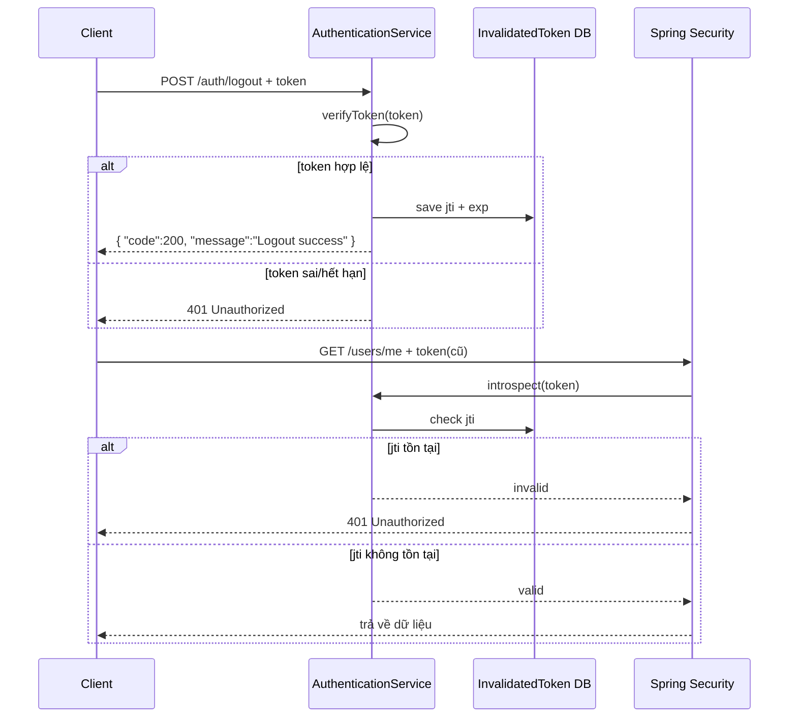

# 🟢 Luồng hoạt động Spring Security với JWT

## 1️⃣ Đăng nhập (Login)

* Người dùng gửi **username + password** đến API `/auth/token`.
* `AuthenticationService` kiểm tra thông tin đăng nhập trong DB.
* Nếu hợp lệ → sinh ra **JWT Token** (bao gồm: username, role, permission, thời gian hết hạn).
* Token được trả về cho **client**.

## 2️⃣ Client lưu token

* **Client** (React, Angular, Mobile App, Postman, ...) lưu token này (thường ở **LocalStorage** hoặc **SessionStorage**).
* Khi gọi API, client phải gắn token vào header:

```
Authorization: Bearer <token>
```

## 3️⃣ Client gọi API bảo vệ

Ví dụ: gọi `GET /users/me` kèm header Authorization.

## 4️⃣ Spring Security kiểm tra token

* Request đi qua `SecurityFilterChain`.
* Nếu endpoint thuộc **PUBLIC_ENDPOINT** → bỏ qua kiểm tra token.
* Nếu cần xác thực:

  * Lấy token từ header.
  * `JwtDecoder` giải mã & kiểm tra chữ ký với `signerKey`.
  * Nếu hợp lệ → tạo `Authentication` (chứa user, role, permission).
  * `JwtAuthenticationConverter` ánh xạ scope/role trong token thành quyền trong Spring.

## 5️⃣ Quyền hạn (Authorization)

* Nếu Controller/Service có annotation `@PreAuthorize("hasRole('ADMIN')")`:

  * Spring Security sẽ kiểm tra token có `ROLE_ADMIN` hay không.
  * Nếu có → cho phép truy cập.
  * Nếu không → trả về **403 Forbidden**.

## 6️⃣ Phản hồi

* Nếu mọi thứ hợp lệ → trả về **JSON Response** cho client.
* Nếu token sai/hết hạn → trả về **401 Unauthorized**.
* Nếu token hợp lệ nhưng không có quyền → trả về **403 Forbidden**.

---

## 🔵 Sơ đồ minh họa

```
[Client] -- username+password --> [Auth API /auth/token]
         <-- JWT Token -----------

[Client] -- GET /users/me + Token --> [Spring Security]
                                      |-- Check token (JwtDecoder)
                                      |-- Map role/permission (JwtAuthenticationConverter)
                                      |-- Check @PreAuthorize
                                      V
                                 [Controller -> Service -> DB]
         <-- JSON Response --------------
```

---

## 🔴 Error Handling trong Spring Security

Spring Security có 2 tình huống lỗi phổ biến khi làm việc với JWT:

### 1️⃣ Lỗi Authentication (401 Unauthorized)

Xảy ra khi:
* Không gửi token
* Token sai định dạng
* Token hết hạn
* Token không verify được chữ ký

👉 Xử lý bằng `JwtAuthenticationEntryPoint`

```java
public class JwtAuthenticationEntryPoint implements AuthenticationEntryPoint {
    @Override
    public void commence(HttpServletRequest request,
                         HttpServletResponse response,
                         AuthenticationException authException)
            throws IOException, ServletException {

        ErrorCode errorCode = ErrorCode.AUTHENTICATED;
        response.setStatus(errorCode.getStatusCode().value());
        response.setContentType(MediaType.APPLICATION_JSON_VALUE);

        ApiResponse<?> apiResponse = ApiResponse.builder()
                .code(errorCode.getCode())
                .message(errorCode.getMessage())
                .build();

        ObjectMapper objectMapper = new ObjectMapper();
        response.getWriter().write(objectMapper.writeValueAsString(apiResponse));
        response.flushBuffer();
    }
}
```

📌 Kết quả trả về:
```json
{
  "code": "AUTHENTICATED",
  "message": "Token không hợp lệ hoặc đã hết hạn"
}
```

---

### 2️⃣ Lỗi Authorization (403 Forbidden)

Xảy ra khi:
* Token hợp lệ nhưng không có quyền (role/permission) để truy cập tài nguyên.

👉 Xử lý bằng `JwtAccessDeniedHandler`

```java
public class JwtAccessDeniedHandler implements AccessDeniedHandler {
    @Override
    public void handle(HttpServletRequest request,
                       HttpServletResponse response,
                       AccessDeniedException accessDeniedException)
            throws IOException, ServletException {

        ErrorCode errorCode = ErrorCode.UNAUTHORIZED;
        response.setStatus(errorCode.getStatusCode().value());
        response.setContentType(MediaType.APPLICATION_JSON_VALUE);

        ApiResponse<?> apiResponse = ApiResponse.builder()
                .code(errorCode.getCode())
                .message(errorCode.getMessage())
                .build();

        ObjectMapper objectMapper = new ObjectMapper();
        response.getWriter().write(objectMapper.writeValueAsString(apiResponse));
        response.flushBuffer();
    }
}
```

📌 Kết quả trả về:
```json
{
  "code": "UNAUTHORIZED",
  "message": "Bạn không có quyền truy cập tài nguyên này"
}
```

---

## ⚙️ SecurityConfig

Trong class `SecurityConfig`, chúng ta cấu hình **Spring Security với JWT** và gắn các handler trên:

```java
@Configuration
@EnableWebSecurity
@EnableMethodSecurity
public class SecurityConfig {
    private final String[] PUBLIC_ENDPOINT = {"/users", "auth/token", "auth/introspect"};

    @Value("${jwt.signerKey}")
    private String signerKey;

    @Bean
    public SecurityFilterChain filterChain(HttpSecurity httpSecurity) throws Exception {
        httpSecurity.authorizeHttpRequests(request ->
                request.requestMatchers(HttpMethod.POST, PUBLIC_ENDPOINT).permitAll()
                        .anyRequest().authenticated());

        httpSecurity.oauth2ResourceServer(oauth2 ->
                oauth2.jwt(jwtConfigurer ->
                        jwtConfigurer.decoder(jwtDecoder())
                                .jwtAuthenticationConverter(jwtAuthenticationConverter()))
                        .authenticationEntryPoint(new JwtAuthenticationEntryPoint()) // Xử lý 401
        );

        httpSecurity.exceptionHandling(ex ->
                ex.accessDeniedHandler(new JwtAccessDeniedHandler()) // Xử lý 403
        );

        httpSecurity.csrf(AbstractHttpConfigurer::disable);

        return httpSecurity.build();
    }

    @Bean
    JwtAuthenticationConverter jwtAuthenticationConverter(){
        JwtGrantedAuthoritiesConverter jwtGrantedAuthoritiesConverter = new JwtGrantedAuthoritiesConverter();
        jwtGrantedAuthoritiesConverter.setAuthorityPrefix(""); // Vì token đã có ROLE_

        JwtAuthenticationConverter jwtAuthenticationConverter = new JwtAuthenticationConverter();
        jwtAuthenticationConverter.setJwtGrantedAuthoritiesConverter(jwtGrantedAuthoritiesConverter);

        return jwtAuthenticationConverter;
    }

    @Bean
    JwtDecoder jwtDecoder(){
        SecretKeySpec secretKeySpec = new SecretKeySpec(signerKey.getBytes(), "HS512");
        return NimbusJwtDecoder
                .withSecretKey(secretKeySpec)
                .macAlgorithm(MacAlgorithm.HS512)
                .build();
    };

    @Bean
    PasswordEncoder passwordEncoder(){
        return new BCryptPasswordEncoder(10);
    }
}
```

---

👉 Như vậy:
- `JwtAuthenticationEntryPoint` → xử lý **401 Unauthorized**
- `JwtAccessDeniedHandler` → xử lý **403 Forbidden**
- `SecurityConfig` → gắn cả 2 vào Spring Security để đảm bảo flow đầy đủ.

# 🔴 Flow xử lý Logout với JWT

## 1️⃣ Client gọi API Logout
- Người dùng muốn thoát → gửi **token hiện tại** đến API `/auth/logout`.
- Request:
```json
POST /auth/logout
{
  "token": "<jwt-token>"
}

# 🔴 Flow xử lý Logout với JWT

## 1️⃣ Client gọi API Logout
Người dùng muốn thoát → gửi **token hiện tại** đến API `/auth/logout`.

**Request:**
```http
POST /auth/logout
Content-Type: application/json

{
  "token": "<jwt-token>"
}
```

---

## 2️⃣ Backend kiểm tra token
Service nhận token và gọi `verifyToken(token)` để:

- Giải mã **JWT** bằng `SIGNER_KEY`.
- Kiểm tra **chữ ký** có hợp lệ không.
- Kiểm tra **token còn hạn** hay đã hết hạn.

👉 Nếu token sai / hết hạn → ném `AppException(ErrorCode.AUTHENTICATED)` → trả về **401 Unauthorized**.

---

## 3️⃣ Lưu token vào blacklist (InvalidatedToken)
Nếu token hợp lệ:

- Lấy ra `JWT ID (jti)` và `thời gian hết hạn (exp)`.
- Tạo bản ghi `InvalidatedToken` và lưu vào DB:
    - `id = jti`
    - `expiryTime = exp`

👉 Mục đích: dù token chưa hết hạn, nhưng nếu đã logout thì coi như **vô hiệu hóa**.

---

## 4️⃣ Các request sau khi logout
Khi client tiếp tục gửi API kèm token cũ:

- `CustomJwtDecoder` gọi `AuthenticationService.introspect(token)`.
- Service kiểm tra DB:
    - Nếu `jti` tồn tại trong `InvalidatedToken` → token **không hợp lệ**.
- Spring Security ném `JwtException` → trả về **401 Unauthorized** qua `JwtAuthenticationEntryPoint`.

---

## 5️⃣ Phản hồi cho client
Khi logout thành công, trả về JSON:

```json
{
  "code": 200,
  "message": "Logout success"
}
```

---

## 🔵 Sơ đồ minh họa



